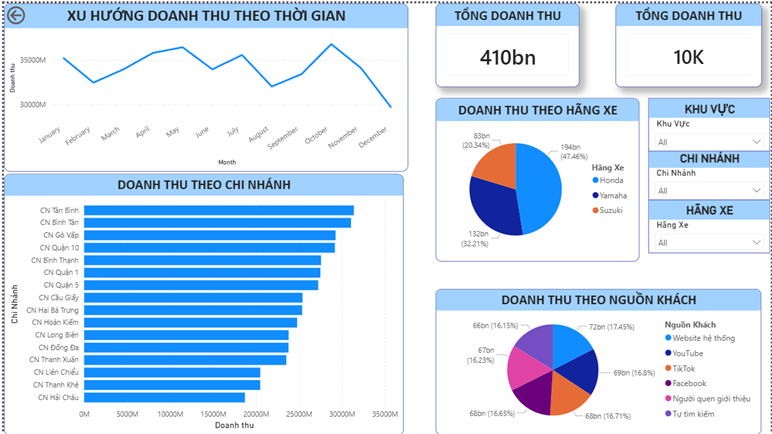
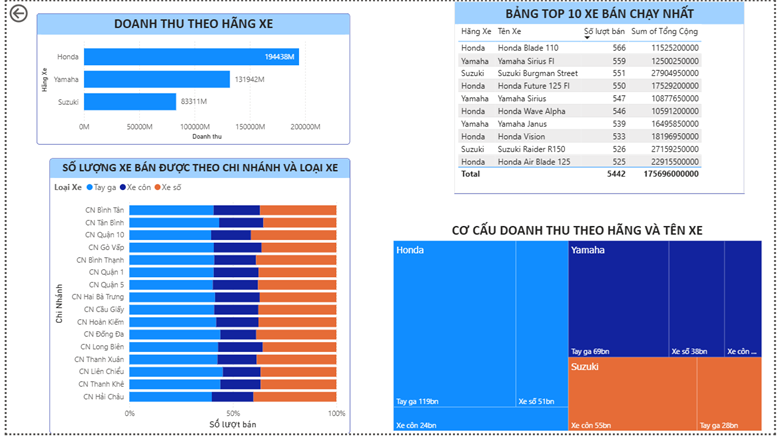

# Phân tích Kinh doanh Hệ thống Phân phối Xe máy KHB bằng Power BI
## 📌 Giới thiệu dự án
Đây là dự án học tập sử dụng Power BI để phân tích và trực quan hóa dữ liệu kinh doanh của hệ thống phân phối xe máy KHB dựa trên bộ dữ liệu he_thong_xe_may_KHB.csv.
Dự án được xây dựng nhằm hỗ trợ theo dõi hiệu quả kinh doanh, đánh giá doanh thu, hiệu suất chi nhánh, hành vi khách hàng và xu hướng bán hàng thông qua dashboard trực quan.

## 🎯 Mục tiêu dự án
Dự án tập trung vào các mục tiêu:
- Phân tích doanh thu của hệ thống theo nhiều góc nhìn
- Theo dõi xu hướng doanh thu theo thời gian
- So sánh hiệu quả kinh doanh giữa các chi nhánh
- Đánh giá đóng góp doanh thu của từng hãng xe
- Phân tích nguồn khách hàng mang lại doanh thu
- Xác định các mẫu xe bán chạy nhất
- Hỗ trợ ra quyết định thông qua trực quan hóa dữ liệu

## 📂 Bộ dữ liệu
Dataset: he_thong_xe_may_KHB.csv
Dữ liệu bao gồm các thông tin như:
- Doanh thu bán hàng
- Chi nhánh phân phối
- Hãng xe
- Loại xe
- Tên xe
- Số lượng bán
- Thời gian giao dịch
- Nguồn khách hàng
  
## 📊 Nội dung Dashboard
### 1. Dashboard Tổng quan kinh doanh

#### Dashboard tổng quan giúp theo dõi:
- Tổng doanh thu
- Tổng số lượt bán
- Xu hướng doanh thu theo tháng
- Doanh thu theo chi nhánh
- Doanh thu theo hãng xe
- Doanh thu theo nguồn khách hàng
#### Insight chính
- Doanh thu duy trì tương đối ổn định trong năm và đạt đỉnh vào tháng 10.
- Honda là thương hiệu mang lại doanh thu lớn nhất, đóng góp gần một nửa tổng doanh thu.
- Các chi nhánh như CN Tân Bình, CN Bình Tân và CN Gò Vấp có hiệu suất doanh thu cao.
- Website là nguồn khách hàng mang lại doanh thu cao nhất, cho thấy hiệu quả của kênh trực tuyến.
  
### 2. Dashboard Phân tích sản phẩm và chi nhánh

#### Dashboard này tập trung vào:
- Doanh thu theo hãng xe
- Top 10 xe bán chạy nhất
- Cơ cấu doanh thu theo hãng và loại xe
- Số lượng xe bán theo chi nhánh và loại xe
#### Insight chính
- Honda chiếm ưu thế cả về doanh thu và sản lượng bán.
- Honda Blade 110 là mẫu xe có số lượng bán cao nhất.
- Xe tay ga là phân khúc mang lại doanh thu lớn nhất.
- Một số chi nhánh có doanh thu thấp hơn mặt bằng chung cần được đánh giá để cải thiện hiệu quả kinh doanh.
  
### 📈 Kết quả phân tích nổi bật

Từ dashboard có thể rút ra một số kết luận:
- Doanh thu theo thời gian
  + Doanh thu có xu hướng biến động theo mùa.
  + Tháng 10 là giai đoạn kinh doanh tốt nhất.
  + Tháng 12 ghi nhận mức giảm đáng kể.
- Theo thương hiệu
  + Honda giữ vai trò thương hiệu chủ lực.
  + Yamaha đứng thứ hai.
  + Suzuki có mức đóng góp thấp hơn và phụ thuộc nhiều vào phân khúc xe côn.
- Theo chi nhánh
  + Doanh thu phân bố không đồng đều giữa các chi nhánh.
   Một số chi nhánh hoạt động nổi bật trong khi một số cần tối ưu hiệu suất bán hàng.
- Theo khách hàng
  + Các nguồn khách hàng khá đa dạng.
  + Website và các kênh digital marketing đóng vai trò quan trọng trong tạo doanh thu.
